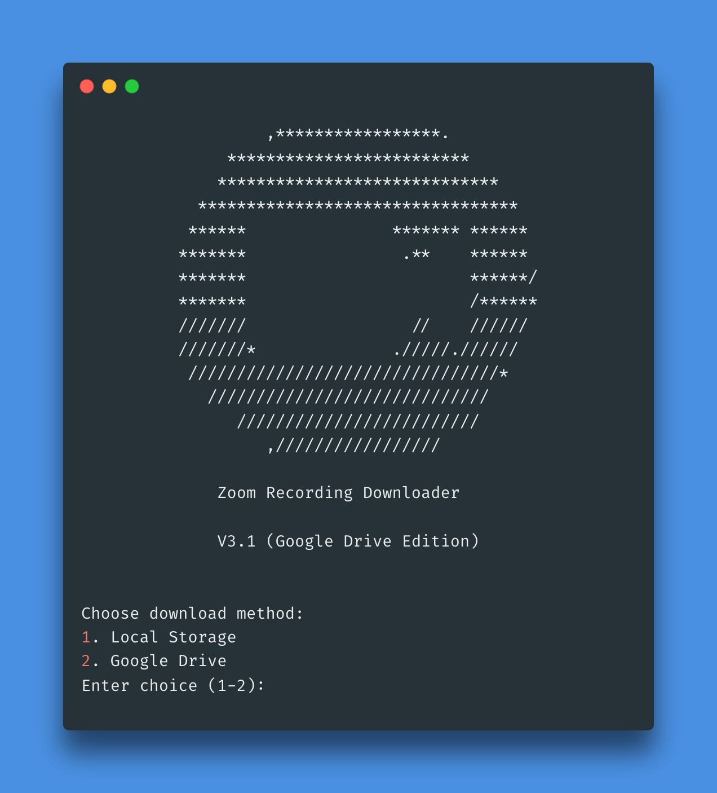

# zoom-recording-downloader

[](https://www.python.org/) [](https://raw.githubusercontent.com/ricardorodrigues-ca/zoom-recording-downloader/master/LICENSE)

**Zoom Recording Downloader** is a cross-platform Python script that uses Zoom's API (v2) to download and organize all cloud recordings from a Zoom account onto local storage.

## Screenshot ##


## Installation ##

_Attention: You will need [Python 3.6](https://www.python.org/downloads/) or greater_

```sh
$ git clone https://github.com/ricardorodrigues-ca/zoom-recording-downloader
$ cd zoom-recording-downloader
$ pip3 install -r requirements.txt
```

## Usage ##

_Attention: You will need a [Zoom Developer account](https://marketplace.zoom.us/) in order to create a [Server-to-Server OAuth app](https://developers.zoom.us/docs/internal-apps) with the required credentials_

1. Create a [server-to-server OAuth app](https://marketplace.zoom.us/user/build), set up your app and collect your credentials (`Account ID`, `Client ID`, `Client Secret`). For questions on this, [reference the docs](https://developers.zoom.us/docs/internal-apps/create/) on creating a server-to-server app. Make sure you activate the app. Follow Zoom's [set up documentation](https://marketplace.zoom.us/docs/guides/build/server-to-server-oauth-app/) or [this video](https://www.youtube.com/watch?v=OkBE7CHVzho) for a more complete walk through.

2. Add the necessary scopes to your app. In your app's _Scopes_ tab, add the following scopes: 
    > `cloud_recording:read:list_user_recordings:admin`, `user:read:user:admin`, `user:read:list_users:admin`.

3. Copy **zoom-recording-downloader.conf.template** to a new file named **zoom-recording-downloader.conf** and fill in your Server-to-Server OAuth app credentials:
```
      {
	      "OAuth": {
		      "account_id": "<ACCOUNT_ID>",
		      "client_id": "<CLIENT_ID>",
		      "client_secret": "<CLIENT_SECRET>"
	      }
      }
```

4. You can optionally add other options to the configuration file:

- Specify the base **download_dir** under which the recordings will be downloaded (default is 'downloads')
- Specify the **completed_log** log file that will store the ID's of downloaded recordings (default is 'completed-downloads.log')

```
      {
              "Storage": {
                      "download_dir": "downloads",
                      "completed_log": "completed-downloads.log"
              }
      }
```

- Specify the **start_date** from which to start downloading meetings (default is Jan 1 of this year)
- Specify the **end_date** at which to stop downloading meetings (default is today)
- Dates are specified as YYYY-MM-DD

```
      {
              "Recordings": {
                      "start_date": "2024-01-01",
                      "end_date": "2024-12-31"
              }
      }
```

- If you don't specify the **start_date** you can specify the year, month, and day seperately
- Specify the day of the month to start as **start_day** (default is 1)
- Specify the month to start as **start_month** (default is 1)
- Specify the year to start as **start_year** (default is this year)

```
      {
              "Recordings": {
                      "start_year": "2024",
                      "start_month": "1",
                      "start_day": "1"
              }
      }
```

- Specify the timezone for the saved meeting times saved in the filenames (default is 'UTC')
- You can use any timezone supported by [ZoneInfo](https://docs.python.org/3/library/zoneinfo.html)
- Specify the time format for the saved meeting times in the filenames (default is '%Y.%m.%d - %I.%M %p UTC')
- You can use any of the [strftime format codes](https://docs.python.org/3/library/datetime.html#strftime-and-strptime-format-codes) supported by datetime

```
      {
              "Recordings": {
                      "timezone": "America/Vancouver",
                      "strftime": "%Y.%m.%d-%H.%M%z"
              }
      }
```

- Specify the format for the filenames of saved meetings (default is '{meeting_time} - {topic} - {rec_type} - {recording_id}.{file_extension}')
- Specify the format for the folder name (under the download folder) for saved meetings (default is '{topic} - {meeting_time}')

```
      {
              "Recordings": {
                      "filename": "{meeting_time}-{topic}-{rec_type}-{recording_id}.{file_extension}",
                      "folder": "{year}/{month}/{meeting_time}-{topic}"
              }
      }
```

For the previous formats you can use the following values
  - **{file_extension}** is the lowercase version of the file extension
  - **{meeting_time}** is the time in the format of **strftime** and **timezone**
  - **{day}** is the day from **meeting_time**
  - **{month}** is the month from **meeting_time**
  - **{year}** is the year from **meeting_time**
  - **{recording_id}** is the recording id from zoom
  - **{rec_type}** is the type of the recording
  - **{topic}** is the title of the zoom meeting

5. Run command:

```sh
$ python zoom-recording-downloader.py
```
